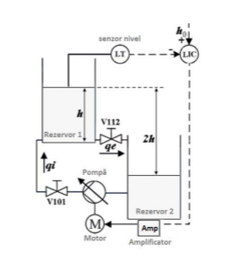

# Level-Control-System-Simulink-Implementation

## Project Overview
This project focuses on modeling and simulating a liquid level control system using Simulink. The system is designed to regulate the level of liquid in a primary reservoir using a PLC-based control loop. The objective is to maintain a stable liquid level by adjusting the pump’s operation based on sensor feedback.

## Process Description
The control system consists of two reservoirs, a pump, a motor, and a set of manual valves. The schematic representation of the process is shown below:

## Main Components:
Reservoir 1 (Rezervor 1): The main tank where liquid is introduced at an inflow rate qi
Reservoir 2 (Rezervor 2): A secondary tank that receives liquid from the first reservoir via an outflow qe
Pump & Motor: The pump transfers liquid from Reservoir 1 to Reservoir 2. The motor controls the pump speed, which determines the liquid transfer rate.
Valves (V101 & V112):
V101 regulates the inflow qi into Reservoir 1.
V112 controls the outflow qe from Reservoir 1 to Reservoir 2.
Ultrasonic Level Sensor (LT - Level Transmitter): Measures the liquid level h
h in Reservoir 1 and sends a signal to the controller.
Level Controller (LIC - Level Indicating Controller): Processes the sensor signal and generates a control command.
Amplifier (Amp): Adjusts the voltage supplied to the motor, influencing the pump speed and, consequently, the liquid transfer rate.

## Control Logic:
The PLC receives the level sensor's signal and compares it to the desired setpoint h0. If deviations occur, the controller adjusts the pump speed to maintain the required liquid level in Reservoir 1. The liquid exits through V112, and the process continues dynamically.

## Simulink Implementation
For this project, Simulink models were developed to simulate the behavior of the control system before real-world implementation. The simulations include:

Mathematical modeling of the reservoirs, pump, and sensor dynamics.
Implementation of control strategies (e.g., PID control) to maintain a stable liquid level.
System response analysis under different operating conditions, such as changes in inflow qi or outflow qe.
Validation of the PLC control logic before deployment on actual hardware.